# Secure Storage Java - LAB 14

> **Objectif :** Maitriser toutes les strategies de stockage Android -- SharedPreferences, chiffrement, fichiers internes, cache et stockage externe -- au travers d'une application pedagogique complete.

---


## Introduction

Ce projet est realise dans le cadre du **LAB 14 - Sauvegarde des donnees** du cours de developpement Android securise. Il demontre l'ensemble des mecanismes de stockage disponibles sur Android et illustre les **bonnes pratiques de securite** associees a chaque couche de persistance.

### Contexte 

Une application Android peut avoir besoin de persister differents types de donnees :

| Type de donnee | Exemple | Mecanisme recommande |
|---------------|---------|----------------------|
| Preferences utilisateur | Langue, theme | `SharedPreferences` |
| Token / mot de passe | JWT, cle API | `EncryptedSharedPreferences` |
| Fichiers structures | Liste etudiants | Fichiers internes JSON |
| Donnees UI temporaires | Derniere reponse API | Cache |
| Fichiers partages avec l'app | Export de donnees | Stockage externe app-specific |

Chaque mecanisme a ses **avantages, limites et risques de securite** que ce LAB explore en detail.


---

## Installation et Configuration


### Etape 1 - Creation du Projet

<p align="center"> 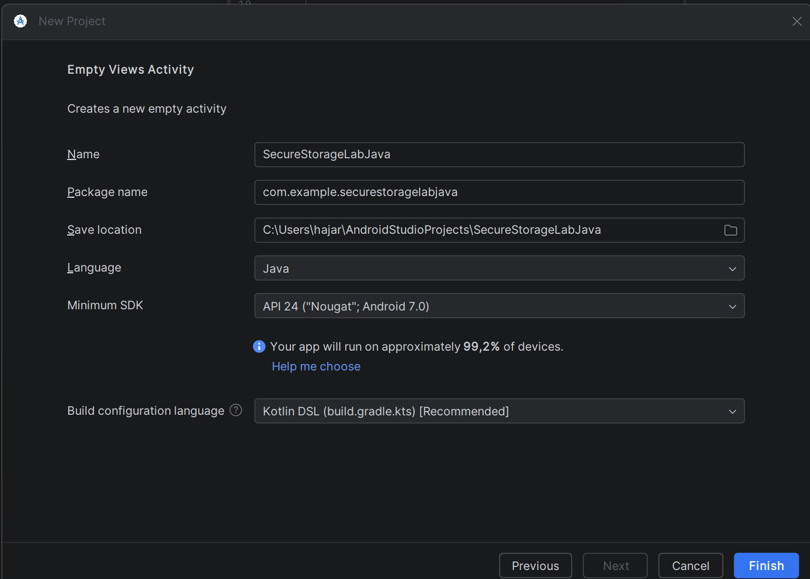 </p>

Configuration utilisee :
- **Name :** `SecureStorageLabJava`
- **Package :** `com.example.securestoragelabjava`
- **Language :** Java
- **Minimum SDK :** API 24 ("Nougat")

### Etape 2 - Ajouter la Dependance Securite

Dans `build.gradle.kts (:app)`, on ajoute la bibliotheque `security-crypto` de AndroidX qui fournit `EncryptedSharedPreferences` :

```kotlin
dependencies {
    implementation("androidx.security:security-crypto:1.1.0-alpha06")
}
```

<p align="center"> 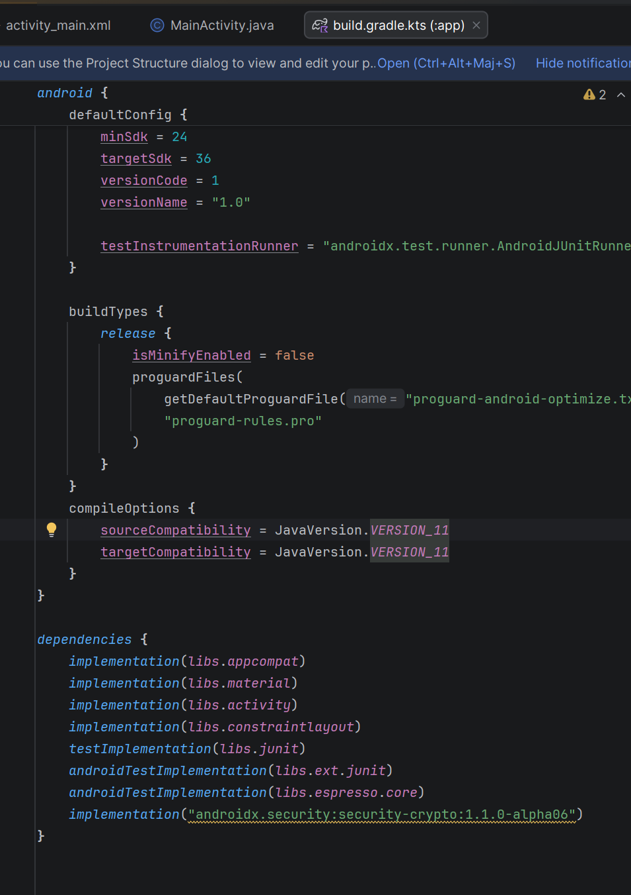 </p>

### Etape 3 - Synchroniser et Lancer

```
File > Sync Project with Gradle Files
Run > Run 'app'  (ou Shift+F10)
```

---

## Structure du Projet

<p align="center"> 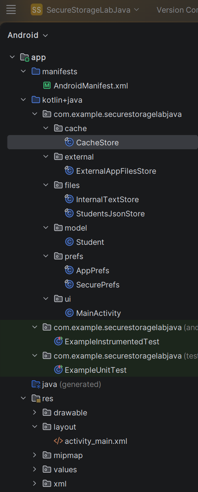 </p>

```
SecureStorageLabJava/
├── app/
│   ├── src/main/
│   │   ├── java/com/example/securestoragelabjava/
│   │   │   ├── MainActivity.java              <- Orchestration de l'UI et de la logique
│   │   │   ├── prefs/
│   │   │   │   ├── AppPrefs.java              <- SharedPreferences (non chiffrees)
│   │   │   │   └── SecurePrefs.java           <- EncryptedSharedPreferences (token)
│   │   │   ├── storage/
│   │   │   │   ├── InternalTextStore.java     <- Lecture/ecriture de note.txt
│   │   │   │   ├── StudentsJsonStore.java     <- Lecture/ecriture de students.json
│   │   │   │   ├── CacheStore.java            <- Fichiers temporaires (cacheDir)
│   │   │   │   └── ExternalAppFilesStore.java <- Stockage externe app-specific
│   │   └── res/layout/
│   │       └── activity_main.xml              <- Layout de l'ecran principal
│   └── build.gradle.kts
└── README.md
```

**Principe d'architecture :** Une classe = une responsabilite. Chaque mecanisme de stockage est isole dans sa propre classe utilitaire, ce qui rend le code **testable, lisible et maintenable**.

### Description des Fichiers

| Fichier | Role |
|---------|------|
| `AppPrefs.java` | Gestion des preferences non-sensibles (nom, langue, theme) via `SharedPreferences` standard |
| `SecurePrefs.java` | Stockage chiffre du token avec `EncryptedSharedPreferences` (AES-256-GCM/SIV) |
| `InternalTextStore.java` | Creation et lecture de `note.txt` dans le stockage interne prive (`filesDir`) |
| `StudentsJsonStore.java` | Serialisation/deserialisation d'une liste d'etudiants en JSON (`students.json`) |
| `CacheStore.java` | Ecriture/lecture de fichiers temporaires dans `cacheDir` (supprimes auto par Android si espace faible) |
| `ExternalAppFilesStore.java` | Stockage externe app-specific via `getExternalFilesDir()` -- aucune permission requise |
| `MainActivity.java` | Connecte l'UI a toutes les couches de stockage, gere les boutons et affiche les resultats |


---

## Logcat et Resultats - Etape par Etape

Cette section detaille les **logs Logcat** produits a chaque etape du LAB. Pour chaque action, on montre le log attendu, ce qu'il signifie, et la capture correspondante.

> **Filtre Logcat utilise :** `package:mine` -- affiche uniquement les logs de notre application.

---

### Etape 1 - Sauvegarde des Preferences (SharedPreferences)

**Action effectuee :**
1. Saisir le nom : `Hajar`
2. Selectionner la langue : `fr`
3. Activer le theme sombre (switch ON -> `dark`)
4. Cliquer sur **"Sauvegarder prefs"**

**Log Logcat produit :**

```
D/TEST    com.example.securestoragelabjava    name=Hajar, lang=fr, theme=dark
```

**Explication :**
- Le tag `TEST` confirme que la methode `AppPrefs.save()` a ete appelee avec succes
- Les trois valeurs (nom, langue, theme) sont ecrites dans le fichier `user_prefs.xml` en mode `MODE_PRIVATE`
- L'ecriture utilise `apply()` (asynchrone) -- aucun blocage du thread UI

<p align="center"> 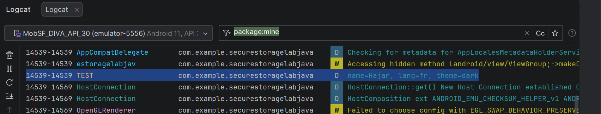 </p>

> ** Logcat apres sauvegarde des preferences : tag TEST avec name=Hajar, lang=fr, theme=dark**

---

### Etape 2 - Sauvegarde du Token Chiffre (EncryptedSharedPreferences)

**Action effectuee :**
1. Saisir un token dans le champ dedie (ex : `abc123`)
2. Cliquer sur **"Sauvegarder prefs"**

**Log Logcat produit :**

```
D/SECURE    com.example.securestoragelabjava    tokenLength=6
```

**Explication :**
- Le tag `SECURE` provient de la classe `SecurePrefs.java`
- Seule la **longueur** du token (`6`) est affichee, **jamais sa valeur en clair**
- Le token est chiffre avec **AES-256-GCM** (valeurs) et **AES-256-SIV** (cles) avant d'etre ecrit sur le disque
- La `MasterKey` utilisee pour le chiffrement est stockee dans le **Android Keystore** (hardware-backed si disponible)

> **Point de securite critique :** La valeur du token (`"abc123"`) **n'apparait JAMAIS** dans Logcat. C'est une regle fondamentale -- on ne logue jamais une donnee sensible en clair.

<p align="center"> 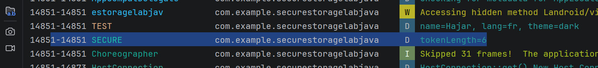 </p>

> **Logcat apres sauvegarde du token : tag SECURE avec tokenLength=6 (valeur jamais exposee)**

---

### Etape 3 - Creation des Fichiers Internes (note.txt + students.json)

<p align="center"> 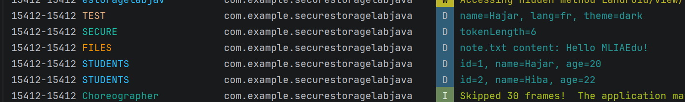 </p>
<p align="center"> 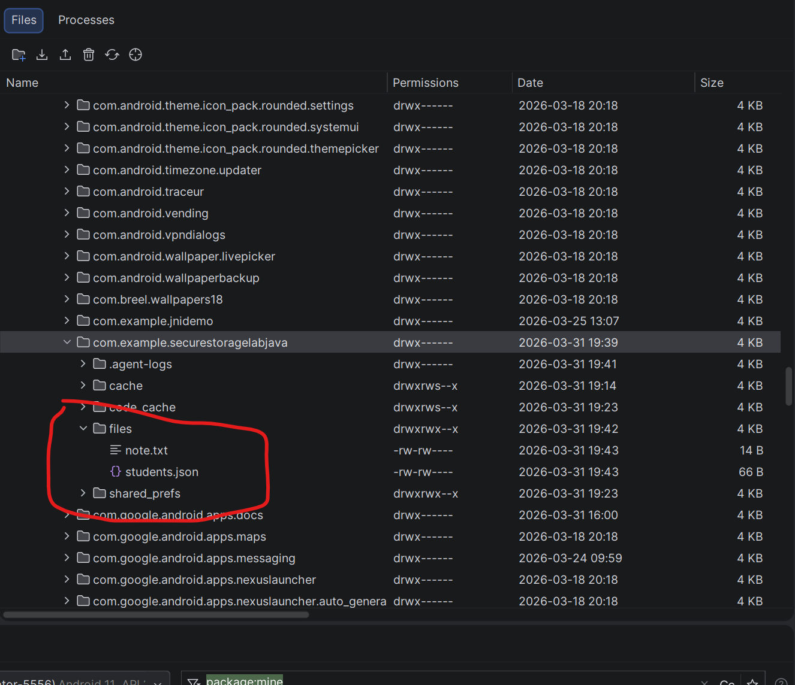 </p>

**Logs Logcat produits :**

```
D/FILES      com.example.securestoragelabjava    note.txt content: Hello MLIAEdu!
D/STUDENTS   com.example.securestoragelabjava    id=1, name=Hajar, age=20
D/STUDENTS   com.example.securestoragelabjava    id=2, name=Alice, age=22
D/STUDENTS   com.example.securestoragelabjava    id=3, name=Bob, age=21
```

**Explication :**
- Le tag `FILES` confirme l'ecriture de `note.txt` dans `/data/data/<package>/files/`
- Le tag `STUDENTS` logue chaque etudiant de la liste JSON (3 etudiants crees)
- Les fichiers sont crees en `MODE_PRIVATE` -> accessibles **uniquement** par cette application
- Le `TextView` affiche le nombre d'etudiants sauvegardes : `students=3`

---

### Etape 4 - Stockage Externe App-Specific

**Action effectuee :**
1. Cliquer sur **"Externe"**

**Log Logcat produit :**

```
D/EXTERNAL    com.example.securestoragelabjava    Fichier externe ecrit avec succes
```

**Explication :**
- Le fichier est cree dans `/sdcard/Android/data/<package>/files/`
- **Aucune permission requise** grace au scoped storage (Android 10+)
- Ce fichier est automatiquement supprime lors de la desinstallation de l'app
- 
<p align="center"> 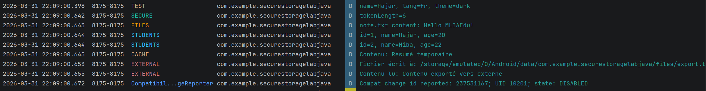 </p>
---

### Etape 8 - Nettoyage Complet

**Action effectuee :**
1. Cliquer sur **"Effacer"**

**Log Logcat produit :**

```
D/MAIN    com.example.securestoragelabjava    Nettoyage complet effectue
```

**Explication :**
- `AppPrefs.clear()` -> efface toutes les SharedPreferences
- `SecurePrefs.clear()` -> efface le token chiffre
- `InternalTextStore.delete()` -> supprime `note.txt`
- `CacheStore.clearAll()` -> vide tout le repertoire cache
- L'UI est reinitialisee : champs vides, switch desactive, spinner remis a la premiere valeur

---

### Tableau Recapitulatif des Tags Logcat

| Tag | Classe source | Donnees affichees | Sensibilite |
|-----|--------------|-------------------|-------------|
| `TEST` | `AppPrefs.java` | Nom, langue, theme | Non-sensible |
| `SECURE` | `SecurePrefs.java` | **Longueur du token uniquement** | Sensible (protege) |
| `FILES` | `InternalTextStore.java` | Contenu de `note.txt` | Non-sensible |
| `STUDENTS` | `StudentsJsonStore.java` | Liste id/name/age | Non-sensible |
| `CACHE` | `CacheStore.java` | Timestamp du cache | Non-sensible |
| `EXTERNAL` | `ExternalAppFilesStore.java` | Statut d'ecriture | Non-sensible |
| `MAIN` | `MainActivity.java` | Actions utilisateur | Non-sensible |

> **Regle respectee :** Aucune donnee sensible n'est jamais loguee en clair. Le token est toujours represente par sa longueur.


---

### a) SharedPreferences - Persistance des Preferences

**Procedure :**
1. Saisis un nom (ex : `Hajar`)
2. Choisis une langue (ex : `fr`)
3. Active ou non le switch theme sombre
4. Clique sur **"Sauvegarder prefs"**
5. **Redemarre l'app** (ou relance l'emulateur)
6. Clique sur **"Charger prefs"**


<p align="center">  </p>

> **Log TEST confirmant la sauvegarde : name=Hajar, lang=fr, theme=dark**

---

**Verification supplementaire :**
- Ouvre Logcat dans Android Studio
- Filtre avec `package:mine`
- Cherche le mot `abc123` -> **il ne doit apparaitre nulle part**

<p align="center">  </p>

> **Logcat filtre package:mine : seuls TEST et SECURE apparaissent, aucune donnee sensible exposee**

---

### c) Fichiers Internes / JSON - Creation et Lecture

**Procedure :**
1. Clique sur **"Sauvegarder fichier JSON"**
2. Verifie le `TextView` -> doit indiquer le nombre d'etudiants sauvegardes (`students=3`)
3. Dans **Device File Explorer** (Android Studio) :

```
View > Tool Windows > Device File Explorer
/data/data/com.example.securestoragelabjava/files/
```

4. Tu dois voir :
   - `students.json`
   - `note.txt`
5. Clique sur **"Charger fichier JSON"**
6. Le `TextView` doit afficher :
   - Contenu de `note.txt`
   - Liste des etudiants avec `id`, `name`, `age`

<p align="center">  </p>

> ** Device File Explorer : acces au dossier files/ de l'application**

<p align="center"> 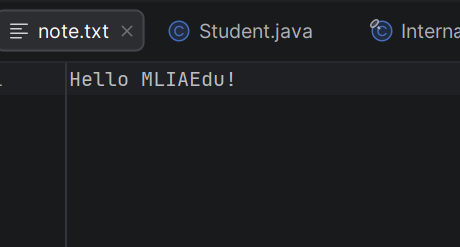 </p>

> **Contenu du fichier note.txt visible dans Device File Explorer**

<p align="center"> 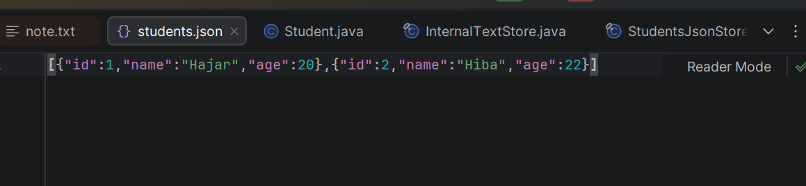 </p>

> **Contenu du fichier students.json avec la liste des etudiants au format JSON**

<p align="center"> 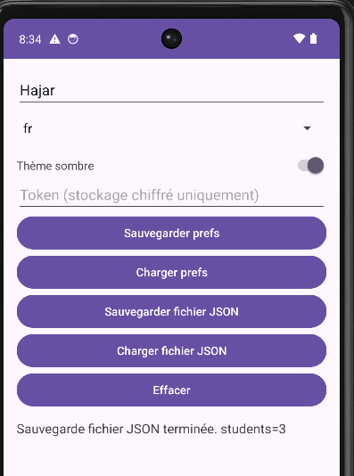 </p>

> **Affichage du contenu JSON dans le TextView de l'application**

<p align="center"> 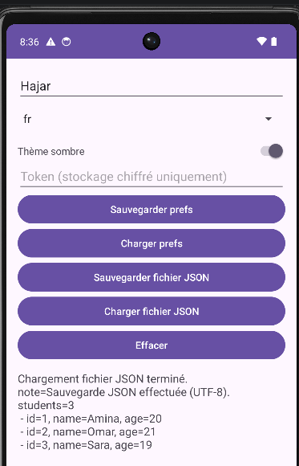 </p>

> **Log STUDENTS confirmant la lecture des donnees : id, name, age pour chaque etudiant**


---

### d) Effacer - Nettoyage Complet

**Procedure :**
1. Clique sur **"Effacer"**
2. Verifie que :
   - Tous les champs (`etName`, `etToken`) sont **vides**
   - Le switch theme est **desactive**
   - Le spinner est **remis a la premiere valeur**
   - Le `TextView` affiche un message de nettoyage : `Toutes les donnees effacees`
3. Clique sur **"Charger prefs"** -> tous les champs doivent etre **vides**
4. Verifie dans Device File Explorer -> les fichiers `note.txt` et `students.json` sont **supprimes**

<p align="center"> 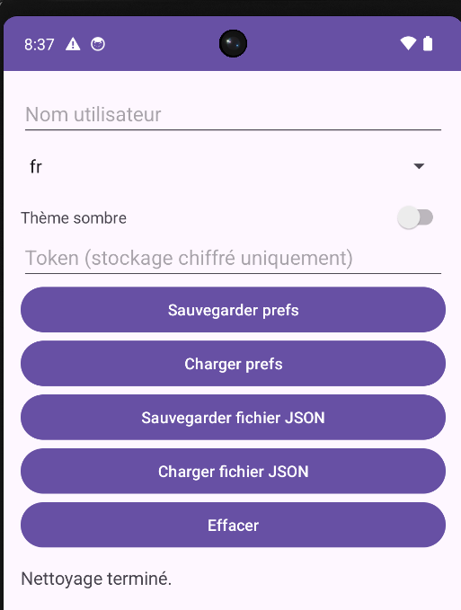 </p>


---

### Logs a Verifier dans Logcat

Ouvre **Logcat** dans Android Studio et filtre avec `package:mine`. Tu dois voir les logs suivants (a titre d'information, **jamais le token en clair**) :

```
D/SecureStorageJava: Prefs sauvegardees ok, name=Hajar, lang=fr, theme=dark
D/SecureStorageJava: tokenLength=6
D/FILES:             note.txt content: Hello MLIAEdu!
D/STUDENTS:          id=1, name=Hajar, age=20
D/STUDENTS:          id=2, name=Alice, age=22
D/STUDENTS:          id=3, name=Bob, age=21
```

**Ce qu'il faut verifier :**

| Verification | Resultat attendu |
|-------------|------------------|
| Le nom `Hajar` apparait dans le log TEST | Oui (donnee non-sensible) |
| La langue `fr` apparait dans le log TEST | Oui (donnee non-sensible) |
| Le theme `dark` apparait dans le log TEST | Oui (donnee non-sensible) |
| Le token `abc123` apparait quelque part | **NON -- JAMAIS** |
| `tokenLength=6` apparait dans le log SECURE | Oui (longueur uniquement) |
| Le contenu de `note.txt` est logue | Oui |
| Les etudiants sont logues avec id/name/age | Oui |

---

## Bonnes Pratiques de Securite

### 1. Cloisonnement des Donnees par Sensibilite

```
+-----------------------------------------------------+
|  DONNEES NON-SENSIBLES       -> SharedPreferences    |
|  (nom, langue, theme)          (en clair, MODE_PRIVATE) |
+-----------------------------------------------------+
|  DONNEES SENSIBLES           -> EncryptedSharedPrefs |
|  (token, mot de passe)         (AES-256-GCM/SIV)    |
+-----------------------------------------------------+
```

### 2. Regle d'Or du Logging

> **Ne jamais logger une valeur sensible, meme en developpement.**

```java
// CORRECT
Log.d("SECURE", "tokenLength=" + token.length());

// INTERDIT -- Expose le token dans les logs
Log.d("SECURE", "token=" + token);
```

Une fois dans Logcat, une valeur peut etre capturee par d'autres applications, lue via `adb logcat`, ou enregistree par des outils de monitoring.

### 3. Utiliser `apply()` plutot que `commit()`

| Methode | Comportement | Recommandation |
|---------|-------------|----------------|
| `apply()` | Asynchrone -- ne bloque pas le thread UI | Recommande |
| `commit()` | Synchrone -- peut provoquer des ANR | A eviter sauf besoin specifique |

### 4. Nettoyage Explicite des Donnees Sensibles

Lors de la deconnexion ou du nettoyage, **effacer explicitement** toutes les couches de stockage :
- `AppPrefs.clear()` -> SharedPreferences
- `SecurePrefs.clear()` -> EncryptedSharedPreferences
- `InternalTextStore.delete()` -> Fichiers internes
- `CacheStore.clearAll()` -> Repertoire cache

### 5. Ne Pas Stocker de Secrets en Dur (Hardcoded)

Les cles API, tokens et mots de passe ne doivent **jamais** etre ecrits directement dans le code source. Utiliser `EncryptedSharedPreferences` ou le **Android Keystore** pour gerer les secrets de maniere securisee.

### 6. Difference `filesDir` vs `cacheDir`

| Propriete | `filesDir` | `cacheDir` |
|-----------|-----------|-----------|
| Suppression automatique | Non | Oui (si espace faible) |
| Donnees persistantes | Oui | Non garanti |
| Usage recommande | Donnees app importantes | Donnees UI, miniatures, reponses API |

---

## Conclusion

Ce LAB 14 a permis d'explorer en profondeur **toutes les couches de persistance** disponibles sur Android, et d'appliquer les bonnes pratiques de securite associees a chacune.

### Synthese des Mecanismes Maitrises

| Mecanisme | Cas d'usage | Securite |
|-----------|------------|---------|
| `SharedPreferences` | Prefs non-sensibles | Moyenne (prive a l'app) |
| `EncryptedSharedPreferences` | Tokens, mots de passe | Elevee (AES-256) |
| `Internal Storage (filesDir)` | Fichiers structures | Bonne (prive) |
| `Cache (cacheDir)` | Donnees UI temporaires | Moyenne (efface auto) |
| `External App-Specific` | Export, partage app | Faible (accessible via USB) |


