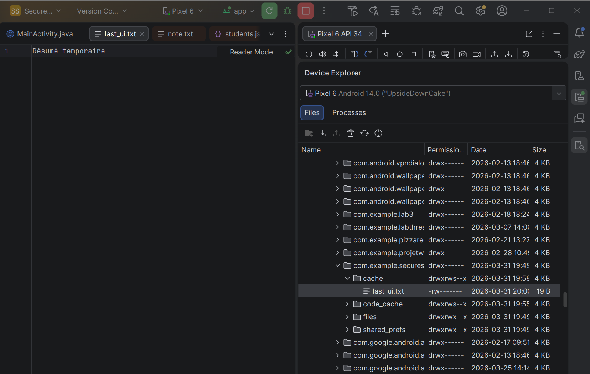
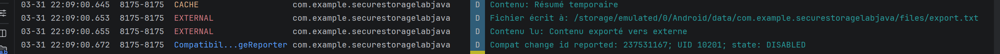

#  Secure Storage Java – LAB 14

> **Objectif :** Maîtriser toutes les stratégies de stockage Android — SharedPreferences, chiffrement, fichiers internes, cache et stockage externe — au travers d'une application pédagogique complète.

---

##  Introduction

Ce projet est réalisé dans le cadre du **LAB 14 – Sauvegarde des données** du cours de développement Android sécurisé. Il démontre l'ensemble des mécanismes de stockage disponibles sur Android et illustre les **bonnes pratiques de sécurité** associées à chaque couche de persistance.

### Contexte et Motivation

Une application Android peut avoir besoin de persister différents types de données :

| Type de donnée | Exemple | Mécanisme recommandé |
|---------------|---------|----------------------|
| Préférences utilisateur | Langue, thème | `SharedPreferences` |
| Token / mot de passe | JWT, clé API | `EncryptedSharedPreferences` |
| Fichiers structurés | Liste étudiants | Fichiers internes JSON |
| Données UI temporaires | Dernière réponse API | Cache |
| Fichiers partagés avec l'app | Export de données | Stockage externe app-specific |

Chaque mécanisme a ses **avantages, limites et risques de sécurité** que ce LAB explore en détail.

---

##  Fonctionnalités

-  **Sauvegarde des préférences** : nom, langue, thème via `SharedPreferences`
-  **Chargement automatique** des préférences au redémarrage de l'app
-  **Stockage sécurisé du token** via `EncryptedSharedPreferences` (AES-256)
-  **Création de fichiers internes** : `note.txt` et `students.json`
-  **Cache temporaire** des données UI dans `cacheDir`
-  **Stockage externe app-specific** sans permission requise (Android 10+)
-  **Nettoyage complet** : effacement de toutes les données et du cache

---


##  Installation et Configuration

### Prérequis

- Android Studio (Hedgehog ou supérieur recommandé)
- JDK 11+
- Un émulateur Android (API 24 minimum) ou un appareil physique

<p align="center">  </p>

Configuration utilisée :
- **Name :** `SecureStorageLabJava`
- **Package :** `com.example.securesentoragelabjava`
- **Language :** Java
- **Minimum SDK :** API 24 ("Nougat")

### Étape 3 – Ajouter la Dépendance Sécurité

Dans `build.gradle.kts (:app)` :

```kotlin
dependencies {
    implementation("androidx.security:security-crypto:1.1.0-alpha06")
    // ... autres dépendances standard
}
```

<p align="center">  </p>

### Étape 4 – Synchroniser et Lancer

```
File > Sync Project with Gradle Files
Run > Run 'app'  (ou Shift+F10)
```

---

##  Structure du Projet
<p align="center">  </p>

```
SecureStorageLabJava/
├── app/
│   ├── src/main/
│   │   ├── java/com/example/securestorage labjava/
│   │   │   ├── MainActivity.java              ← Orchestration de l'UI et de la logique
│   │   │   ├── prefs/
│   │   │   │   ├── AppPrefs.java              ← SharedPreferences (non chiffrées)
│   │   │   │   └── SecurePrefs.java           ← EncryptedSharedPreferences (token)
│   │   │   ├── storage/
│   │   │   │   ├── InternalTextStore.java     ← Lecture/écriture de note.txt
│   │   │   │   ├── StudentsJsonStore.java     ← Lecture/écriture de students.json
│   │   │   │   ├── CacheStore.java            ← Fichiers temporaires (cacheDir)
│   │   │   │   └── ExternalAppFilesStore.java ← Stockage externe app-specific
│   │   └── res/layout/
│   │       └── activity_main.xml              ← Layout de l'écran principal
│   └── build.gradle.kts
└── README.md
```

**Principe d'architecture :** Une classe = une responsabilité. Chaque mécanisme de stockage est isolé dans sa propre classe utilitaire, ce qui rend le code testable et maintenable.

---


## 📊 Logcat et Résultats

### Logs Attendus par Étape

**Phase 1 – Sauvegarde des préférences :**

<p align="center">  </p>


**Phase 2 – Sauvegarde du token chiffré :**

<p align="center">  </p>


>  **Observation critique :** La valeur du token (`"123456"` par exemple) **n'apparaît JAMAIS** dans Logcat. Seule sa longueur est loguée, ce qui permet de confirmer l'écriture sans exposer la donnée sensible.

<p align="center">  </p>


### Analyse des Logs

| Tag | Signification | Données affichées |
|-----|--------------|-------------------|
| `TEST` | Préférences standards chargées | Nom, langue, thème (non-sensibles) |
| `SECURE` | Token chiffré sauvegardé | **Longueur uniquement** (jamais la valeur) |
| `MAIN` | Actions utilisateur | Événements de navigation |

---

##  Vérifications Fil Rouge

Ces vérifications constituent les **critères d'acceptance** du LAB :

### Vérification 1 – Persistance des Préférences

1. Saisir `Hajar`, sélectionner `fr`, activer le thème dark
2. Cliquer **Sauvegarder prefs**
3. **Fermer et relancer l'application**
4. Cliquer **Charger prefs** → les valeurs doivent être restaurées automatiquement

✔ Les préférences survivent à l'arrêt de l'application.

### Vérification 2 – Sécurité du Token

1. Saisir un token dans le champ correspondant
2. Cliquer **Sauvegarder prefs**
3. Ouvrir Logcat, filtrer `package:mine`
4. Vérifier que seul `tokenLength=X` apparaît, **jamais la valeur du token**

✔ Le token n'est **jamais exposé** en clair dans les logs.

### Vérification 3 – Fichiers Internes via Device File Explorer

Dans Android Studio :
```
View > Tool Windows > Device File Explorer
/data/data/com.example.securestorage labjava/files/
```

On doit y trouver :
- `note.txt` avec le texte écrit
- `students.json` avec la liste des étudiants au format JSON
- 
<p align="center">  </p>

<p align="center">  </p>
<p align="center">  </p>
<p align="center">  </p>
<p align="center">  </p>

<p align="center">  </p>


---

##  Bonnes Pratiques de Sécurité

### 1. Cloisonnement des Données par Sensibilité

```
┌─────────────────────────────────────────────────────┐
│  DONNÉES NON-SENSIBLES       → SharedPreferences    │
│  (nom, langue, thème)          (en clair, MODE_PRIVATE) │
├─────────────────────────────────────────────────────┤
│  DONNÉES SENSIBLES           → EncryptedSharedPrefs │
│  (token, mot de passe)         (AES-256-GCM/SIV)   │
└─────────────────────────────────────────────────────┘
```

### 2. Règle d'Or du Logging

> **Ne jamais logger une valeur sensible, même en développement.**

```java
//  CORRECT
Log.d("SECURE", "tokenLength=" + token.length());

//  INTERDIT — Expose le token dans les logs
Log.d("SECURE", "token=" + token);
```

Une fois dans Logcat, une valeur peut être capturée par d'autres applications, lue via `adb logcat`, ou enregistrée par des outils de monitoring.

### 3. Utiliser `apply()` plutôt que `commit()`

```java
//  Asynchrone — ne bloque pas le thread UI
editor.apply();

// Synchrone — peut provoquer des ANR en cas de lenteur I/O
editor.commit();
```

### 4. Nettoyage des Données Sensibles

Lors de la déconnexion ou du nettoyage, **effacer explicitement** toutes les couches :

```java
AppPrefs.clear(this);   // SharedPreferences
SecurePrefs.clear(this); // EncryptedSharedPreferences
InternalTextStore.delete(this); // Fichiers internes
CacheStore.clearAll(this); // Cache
```

### 5. Ne Pas Stocker de Secrets en Dur (Hardcoded)

```java
//  MAUVAISE PRATIQUE
private static final String API_KEY = "sk-1234567890abcdef";

//  BONNE PRATIQUE : utiliser EncryptedSharedPreferences ou Android Keystore
String apiKey = SecurePrefs.loadToken(this);
```


##  Conclusion

Ce LAB 14 a permis d'explorer en profondeur **toutes les couches de persistance** disponibles sur Android, et d'appliquer les bonnes pratiques de sécurité associées à chacune.

### Points Clés Retenus

1. **Segmenter les données** selon leur niveau de sensibilité
2. **Ne jamais logger** les valeurs sensibles — afficher uniquement leur longueur ou un hash
3. **Chiffrer** toutes les données sensibles au repos avec Android Keystore
4. **Nettoyer explicitement** toutes les couches lors de la déconnexion
5. **Préférer `apply()`** à `commit()` pour éviter les blocages UI

### Perspectives

Ce projet constitue une base solide pour évoluer vers des patterns de sécurité plus avancés :
- **Android Keystore** pour la gestion de clés cryptographiques
- **Certificate Pinning** pour sécuriser les communications réseau
- **ProGuard / R8** pour l'obfuscation du code compilé
- **SafetyNet / Play Integrity** pour la détection de tampering

---


